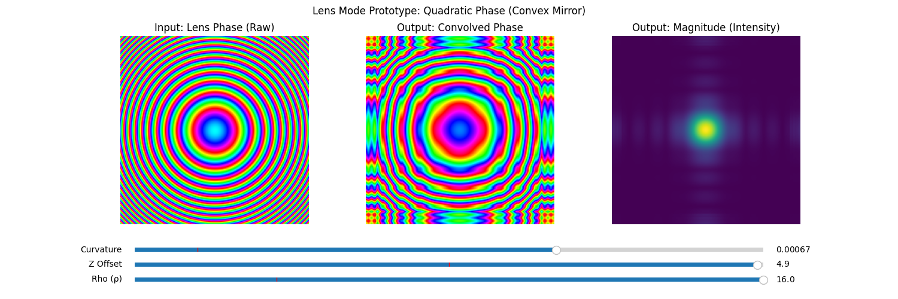

# rpi_photonics_sim

A handheld partial-coherence simulator. A Raspberry Pi, a 2.8 inch SPI TFT, two
joysticks and a potentiometer. You turn a knob and the phase screen changes under
your thumb at 30 frames a second.

I built it as a birthday present for a friend who studies this for a living.



## What it simulates

Two separate physics engines ship here. They model different things and share no code.

### Engine 1, partial spatial coherence

A phase screen is a field of random optical phase. If the phase is uncorrelated
point to point the light is spatially incoherent, and if it is perfectly
correlated the light is coherent. Everything interesting lives in between, and
the knob that sets where you are is the correlation length.

The engine builds a screen by convolving white phase noise with a kernel. The
kernel shape sets how correlation decays with distance, and two families ship:

| Mode | Kernel | Decay |
| :--- | :--- | :--- |
| `gaussian` | `exp(-r² / ρ²)` | Gaussian |
| `rational` | `1 / (1 + (r/ρ)^1.5)` | polynomial, heavy tailed |

The implementation detail that matters is in `simulation_code.py:92-99`. Phase is
wrapped to (-π, π], so filtering it directly smears the branch cut into garbage.
Instead the engine convolves `cos(φ)` and `sin(φ)` separately and recovers the
phase with `arctan2`. Same trick in all three ports.

The modulus of the convolved complex field is the local complex coherence factor,
and the device shows it as its own view.

### Engine 2, a Gaussian beam off a rough mirror

`mirror_physics.py`. A 1 µm Gaussian beam with a 1 mm waist over a 6 mm field of
view, reflecting off a mirror that has both curvature and roughness.

The beam carries full Gaussian optics at the mirror plane, so Rayleigh range,
spot size `w(z)`, wavefront curvature `R(z)` and the Gouy phase. Mirror roughness
is generated by FFT filtering white noise with a Gaussian spectral filter, then
renormalised to a target RMS height `σ_h` selectable in fractions of λ from 0 to
λ/2. The noise seed is fixed at 42 so the surface stays put while the beam moves
over it.

Reflection is

```python
E_ref = A * np.exp(-1j * phi_inc) * np.exp(1j * 2 * K * h)
```

The factor of 2 on `K*h` is there because the beam crosses each surface deviation
twice. Interference is `|E_inc + E_ref|²`.

### The correlation matrix, both ways

The device computes `Q_p` twice and lets you flip between them.

- `statistical` is the ideal analytic form, `exp(-Δr² / ℓ²)`.
- `empirical` samples the phase off the mirror surface actually synthesised,
  `(cos(φᵢ - φⱼ) + 1) / 2`.

Watching those two disagree is the whole point of the toggle.

## Prior work

The physics comes from

> B. Schreyer, D. Younis, D. Kaganovich, L. A. Johnson, T. M. Antonsen, and
> B. Hafizi, "Realization of nontrivial partial spatial coherence by a
> deformable mirror," *Applied Optics* **64**(17), 2025.
> [doi:10.1364/AO.557755](https://doi.org/10.1364/AO.557755)

That paper generates partially coherent phase screens by singular-value
decomposition of a correlation matrix, realises ensembles of 10,000 screens at
kHz rate on a deformable mirror unit, and measures them with a Shack-Hartmann
wavefront sensor. The two correlation-decay families implemented here are the two
studied there.

This repository contains no part of that paper. Read it at the DOI above.

## What this is not

- It is not a solver. No FDTD, no BPM, no beam propagation of any kind.
- It does not do the SVD ensemble generation the paper actually runs. It
  generates a single screen per frame by convolution.
- It does not model the deformable mirror. No actuator grid, no influence
  functions, no stroke limits.
- The physics grid is small because the target was 30 FPS on a Pi 3.

## Run modes

Four entry points. Two need the hardware, two do not.

| Entry point | Needs a Pi | Engine | Display | Input |
| :--- | :---: | :--- | :--- | :--- |
| `mirror_sim.py` | no | mirror | pygame window | keyboard |
| `device_mockup.html` | no | coherence | browser canvas | mouse |
| `mirror_sim_pi.py` | yes | mirror | SPI TFT | 2 joysticks over serial |
| `tft_emulator.py` | yes | coherence | SPI TFT | serial, 5 buttons, LEDs, piezo |

### Without hardware

```bash
python3 -m venv venv && source venv/bin/activate
pip install numpy scipy pygame
python3 mirror_sim.py
```

WASD moves the beam, arrows drive the menu, Q cycles the six views, SPACE opens
the menu. The six views are roughness, total surface, interference, reflected
phase, beam amplitude and the `Q_p` matrix.

For the browser build, open `device_mockup.html` directly. It is one file, 700
lines, no dependencies and no build step. It runs from `file://`.

`web_server.py` serves the same page and adds a JSON API at `/api/inputs`, so a
phone can drive the simulation running on the Pi's screen.

```bash
python3 web_server.py --host 0.0.0.0 --port 8000
```

### On the device

`software_setup_guide.md` is the full path from a blank SD card. `build_guide.md`
has the bill of materials and the pinout. `wiring_instructions.md` has the
breadboard wiring.

```bash
sudo python3 tft_emulator.py --driver ili9341 --cs CE1 --dc D24 --rst D25
```

Four systemd units are included for autostart.

## Three implementations of the same convolution

The coherence engine exists three times, and each one solves the convolution
differently.

| File | Method |
| :--- | :--- |
| `simulation_code.py:95-96` | `scipy.signal.fftconvolve`, linear, `mode='same'` |
| `tft_emulator.py:526-532` | cached `np.fft.fft2` kernel, multiply, `ifft2` |
| `device_mockup.html:519-544` | brute-force spatial loops in JavaScript |

The middle one is circular rather than linear convolution, so the phase screen
wraps at the edges on the device and does not wrap on the desktop. That is a real
behavioural difference and not only an optimisation.

## Making it fast enough

The Pi 3 has to composite a 320x240 frame and push it over SPI 30 times a second.

- Colormaps are precomputed once into 256x3 uint8 lookup tables, so colouring a
  frame is one fancy-index rather than a Python loop
  (`mirror_sim_pi.py:119-122`).
- The phase colormap is a 3 phase sine wheel that is genuinely cyclic, meaning
  t=0 and t=1 give the same RGB. A wrapped phase display needs that or it shows a
  false seam at ±π (`mirror_sim_pi.py:96-104`).
- Resampling is nearest-neighbour through integer index arrays and `np.ix_`,
  which skips PIL's resize entirely (`mirror_sim_pi.py:497-504`).
- The convolution kernel FFT is cached and only rebuilt when ρ or the mode
  changes (`tft_emulator.py:458-489`).
- `Q_p` is O(n⁴) and is the only throttled computation. It runs at 2 Hz and only
  while its view is on screen (`mirror_sim_pi.py:720-722`).
- Fidelity is one knob that moves display resolution and `Q_p` grid size
  together, from 8/4 up to 240/24 (`mirror_sim_pi.py:45-50`).

Serial input is read drop-to-latest rather than line by line, so a backlog in the
buffer never turns into control lag (`mirror_sim_pi.py:179-183`). The joystick
deadzone is 50 counts out of 1024 and rescales over the remaining 462 so there is
no discontinuity at the deadzone edge.

## The debugging log

Six scripts in here are not tools. They are a preserved record of one evening
spent on an ILI9341 that initialised without raising and displayed nothing.

| Script | What it was chasing |
| :--- | :--- |
| `hardware_test.py` | does the happy path work at 1 MHz |
| `diagnose.py` | sweep driver against chip-select at 8 MHz |
| `slow_diagnose.py` | is it a clock speed problem |
| `pin_search.py` | sweep pin assignments |
| `soft_spi_test.py` | rule out the hardware SPI driver |
| `touch_debug.py` | XPT2046 resistive touch |

Three things that log records honestly.

Clock speed was never the fault. Those scripts walk down from 8 MHz to 1 MHz and
production ships at 64 MHz.

`pin_search.py` labels `CE0/D24/D25` as "Golden Standard" and `CE1/D24/D25` as
"Old Standard". Production runs CE1, which is what my own wiring guide said all
along.

`soft_spi_test.py` claims in its header to bit-bang SPI and bypass the hardware
driver. It calls `busio.SPI`. It is ordinary hardware SPI and it never tested what
it says it tests, so the driver was never actually eliminated as a suspect.

Touch was cut. `tft_emulator.py:600` reads `# Touch Config (XPT2046) - REMOVED`
and the pin it used became a button. The likely reason it never worked is in
`touch_debug.py:55`, which creates the interrupt line with no pull-up. PENIRQ is
open-drain, so the line floats and the read is noise.

## Known rough edges

Fixed before publishing:

- `web_server.py` had an arbitrary file read. The containment check was a string
  prefix test on an unresolved path, so a request target with no leading slash
  kept its `..` segments and escaped the repository root. It served `/etc/hosts`
  over HTTP. It now resolves with `realpath` before comparing. The unit file runs
  as root on `0.0.0.0`, which is what made it worth fixing rather than noting.
- `tft_emulator.py` raised `AttributeError` on any button press off-Pi, because
  the serial branch of `update()` runs before the hardware guard and `_beep`
  touched a piezo that was never constructed.
- The kernel centring roll used `-h//2`, which Python parses as `(-h)//2`. The
  kernel is always odd sized, so every convolved frame was translated by one
  pixel.

Still open:

- `--physics` in `tft_emulator.py` is declared and read nowhere. The physics grid
  is hardcoded to 240.
- The MCP3008 path in `tft_emulator.py` constructs its channels and never reads
  them. Consequently `--no-adc` does nothing, and a device built to the
  digital-only wiring has no way to change ρ, which is the headline parameter.
- Torn serial lines parse as valid data. `read_all()` has no line-boundary sync,
  so a truncated fragment that still holds 7 comma-separated fields yields a bogus
  joystick value with no exception.
- Any parse failure closes the serial port for 2 seconds. A malformed line and a
  real USB unplug are handled identically.
- `mirror_sim_pi.py` cycles the view on press rather than release, so a
  hold-to-reset also fires a view change first, then re-arms and repeats every 3
  seconds while held.
- The beam Y sign in `mirror_sim_pi.py:770` contradicts the axis remap comment at
  `:211`. One of the two is stale and it needs a bench check.
- `lens_test.py` carries an older copy of the mirror physics with two parameters
  its `compute_Qp_matrix` never uses and a resolution-dependent `Q_p` reference
  scale. `mirror_physics.py` is the maintained one.
- `_generate_perlin_noise` is a sum of sinusoids and not Perlin noise.
- The FFT roughness filter produces a real 1/e autocorrelation length around 2.4
  to 3.0 times the `corr_len` parameter, while the statistical `Q_p` uses the bare
  parameter. The two panels do not use the same definition of ρ₀.
- The systemd units run as root. SPI and GPIO access is the reason, and a
  `gpio`/`spi` group user would be better.

## Layout

```
mirror_physics.py       Gaussian beam + rough mirror, the shared core
simulation_code.py      partial coherence engine, reference implementation
mirror_sim.py           desktop build, pygame
mirror_sim_pi.py        device build, PIL + SPI TFT + dual joystick
tft_emulator.py         device build, coherence engine, buttons and piezo
web_server.py           stdlib HTTP server and JSON input API
device_mockup.html      browser build, self contained, no dependencies
lens_test.py            matplotlib workbench, the ancestor of mirror_physics.py
*.service               systemd units
build_guide.md          bill of materials and pinout
wiring_instructions.md  breadboard wiring
software_setup_guide.md blank SD card to running device
```

## License

MIT. See `LICENSE`.
